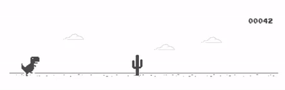
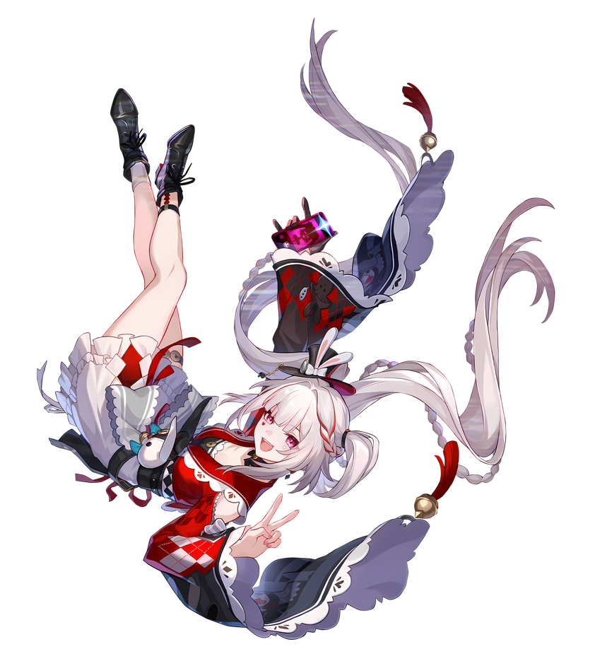
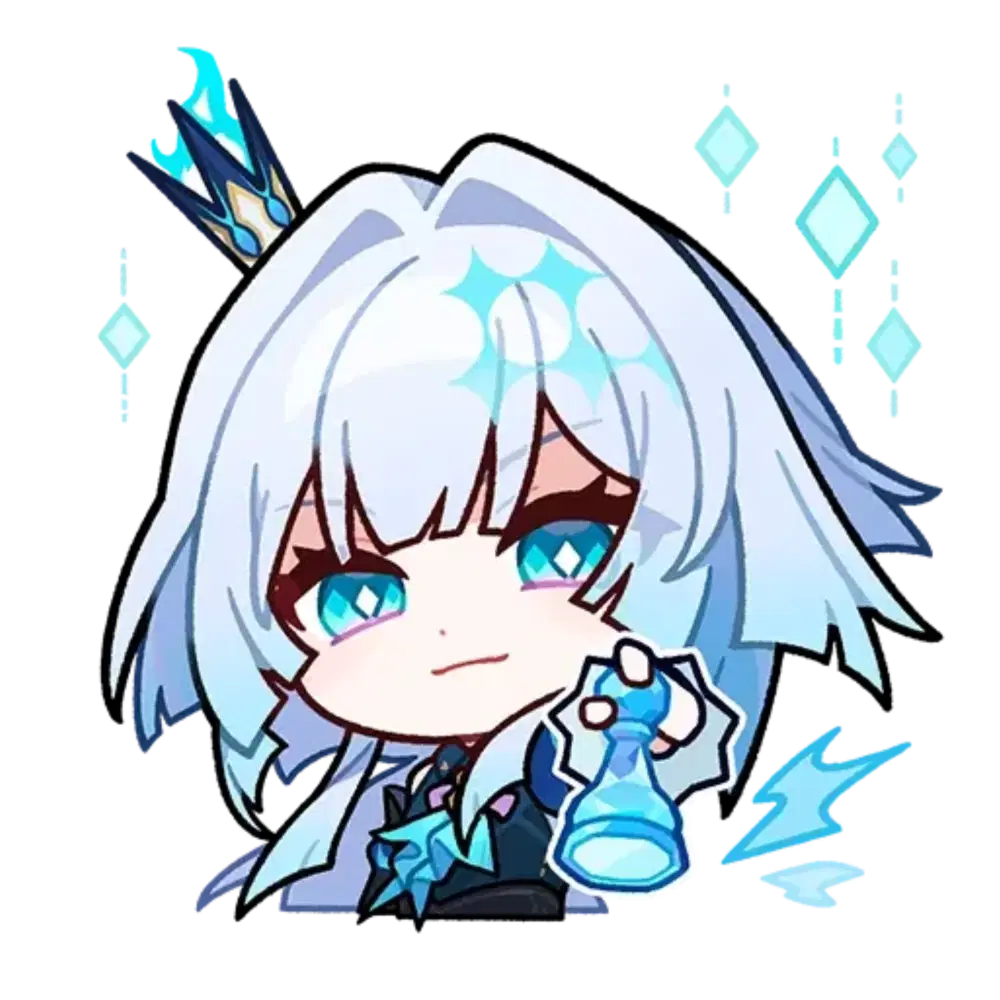

 
 

 
 
 
 

 <h1 align="center">    Jefferson Reis  ദ്ദി(˵ •̀ ᴗ - ˵ ) ✧</h1>
 <h2 align="center">      Software Enginner Student | Front End | Digital Artist</h2>

 <table border="0">
 <tr>
    <td valign="top">
 
 # Sobre mim ๋࣭ ⭑⚝

 
   Olá pessoa que está olhando meu readme! Bom logo me apresentando me chamo Jefferson, sou de SP, estudante de Engenharia de Software e Artista! Junto meus 2 mundos (criativo e lógico) e são ambas áreas que busco conciliar nos meus projetos e trajetoria profissional. 

 </td>
     <td width=350" valign="top">
 
 </td>
 </tr>
 <table> 

   ## Hobbies 🌱

   ⬩➤ Gosto de jogar(Genshin, Honkai, WildRift, Mobile Legends); 
   ⬩➤ Desenhar, tanto no digital ou no tradicional(porem prefiro no digital); 
   ⬩➤ Alguns Animes e series que curto: Stranger Things, Girl from Nowhere, Steven Universo, Banana Fish(easter egg do 'Eiji' do meu nick)  
   ⬩➤ Cantores fav: Billie Eilish, Melanie Martinez, Lana Del Rey, Jão, Olivia Rodrigo, entre outros! 
     ∘₊✧────────────────────--⭒˗ˏˋ𓆩 ⚠ 𓆪ˎˊ˗⭒--───────────────────✧₊∘
     
   
<table border="0">
<tr>
<td valign="bottom">

 ## Ferramentas Tech / Design

</td>
<td width="150" valign="bottom">

</td>
</tr>
</table>

 ## Algumas linguagens que utilizo nos projetos, ferramentas e design, tanto em software tanto na area  criativa 
 
 

 

 
## Status ılıılıılıılıılı

 

## Me Siga nas Redes:

 
<a href= "jefersonreis218@gmail.com">
 
<a href="https://www.linkedlin.com/in/jeffereiss">
 
<a href="https://www.instagram.com/jefersonreis218/">

<a href="https://www.twitch.tv/jeffersonreiss">

<a href="https://www.tiktok.com/@jeffersonreis218">

 
 

  

